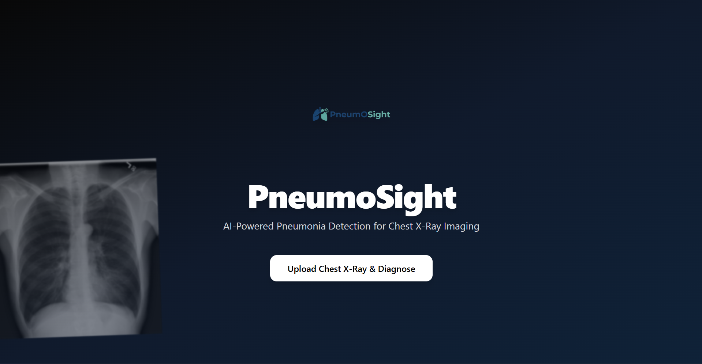

## 📌 Overview
PneumoSight is an Artificial Intelligence based system that proposes a solution for the early detection of pneumonia using Chest X-Ray images. This AI system based on a Convolutional Neural Network (CNN) algorithm to automatically classify lung X-ray images into Normal and Pneumonia categories as an early diagnostic support tool for healthcare professionals.

## ✨ Features
- Automatic classification of Chest X-Ray images into Normal and Pneumonia categories
- Display of classification accuracy percentage to represent model performance

## ⚙️ Technologies Used
Frontend
- React

Backend
- Python
- Flask
- Flask-CORS
- TensorFlow & Keras — loading and running the AI model
- NumPy & OpenCV — image preprocessing

AI Training
- NumPy, Pandas — data manipulation and analysis
- Matplotlib, Seaborn — training data visualization
- Scikit-learn — dataset splitting and model evaluation
- TensorFlow & Keras — CNN model training
- OpenCV — image preprocessing and data augmentation

## 🚀 Installation
If you want to run this project locally, follow these steps :
1. Clone the repository
```
git clone https://github.com/GerasimosAlpen/PneumoSightAI.git
```
2. Navigate to the project directory:
```
cd PneumoSightAI
```


Client setup : 
1. Navigate to the client directory :
```
cd Client
```
2. Install dependencies :
```
npm install
```
3. Start the development server :
```
npm run dev
```
4. Open the following URL in your browser :
```
http://localhost:5173
```


Server setup : 
1. Navigate to the server directory :
```
cd Server
```
2. Install required dependencies :
```
pip install -r requirements.txt
```
3. Run the server :
```
python app.py
```
4. The backend server will run at:
```
http://localhost:5000
```

## 📦 Requirements
Python packages that are required for the backend
```
flask==3.1.2
flask-cors==6.0.2
tensorflow==2.20.0
numpy==2.2.6
opencv-python==4.12.0
h5py
```

## ✨ Screenshots

